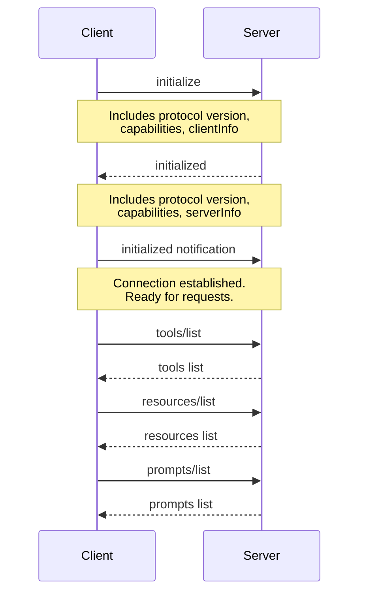

# MCP Architecture Overview

This document provides a detailed technical overview of the Model Context Protocol (MCP) architecture and how the servers in this repository implement it.

## Table of Contents

1. [Protocol Overview](#protocol-overview)
2. [Core Concepts](#core-concepts)
3. [Communication Flow](#communication-flow)
4. [Transport Layers](#transport-layers)
5. [Server Architecture](#server-architecture)
6. [Security Model](#security-model)
7. [Implementation Details](#implementation-details)

## Protocol Overview

### What is MCP?

Model Context Protocol (MCP) is an open standard that enables AI applications to integrate with external data sources and tools in a standardized way. It provides:

- **Standardized communication** between AI assistants (clients) and data/tool providers (servers)
- **Security boundaries** for controlling access to resources
- **Extensibility** for adding new capabilities
- **Language agnostic** design supporting multiple programming languages

### Design Principles

1. **Client-Server Architecture**: Clear separation between AI assistants (clients) and resource providers (servers)
2. **Stateless Communication**: Each request is independent and self-contained
3. **JSON-RPC 2.0**: Uses standard JSON-RPC for message formatting
4. **Capability Negotiation**: Clients and servers declare their capabilities during initialization
5. **Security First**: Built-in access control and sandboxing

## Core Concepts

### 1. Tools

Tools are functions that AI assistants can call to perform actions.

**Structure**:
```json
{
  "name": "tool_name",
  "description": "What this tool does",
  "inputSchema": {
    "type": "object",
    "properties": {
      "param1": {
        "type": "string",
        "description": "Parameter description"
      }
    },
    "required": ["param1"]
  }
}
```

**Example Tools**:
- `write_file` (Filesystem): Write content to a file
- `git_commit` (Git): Create a git commit
- `search_nodes` (Memory): Query knowledge graph

**Tool Execution Flow**:
```
Client                    Server
   |                         |
   |-- tools/list --------->|
   |<-- tool definitions ---|
   |                         |
   |-- tools/call ---------->|
   |   {name, arguments}     |
   |                         |
   |<-- result/error --------|
```

### 2. Resources

Resources are data sources that AI assistants can read from.

**Structure**:
```json
{
  "uri": "scheme://path/to/resource",
  "name": "Human-readable name",
  "description": "What this resource contains",
  "mimeType": "text/plain"
}
```

**Resource Types**:
- **Static**: Fixed URIs (e.g., `file:///path/to/file`)
- **Dynamic**: Template-based (e.g., `git://repo/{branch}/file`)

**Resource Access Flow**:
```
Client                    Server
   |                         |
   |-- resources/list ----->|
   |<-- resource list ------|
   |                         |
   |-- resources/read ----->|
   |   {uri}                 |
   |                         |
   |<-- content ------------|
```

### 3. Prompts

Prompts are pre-configured templates for common tasks.

**Structure**:
```json
{
  "name": "prompt_name",
  "description": "What this prompt helps with",
  "arguments": [
    {
      "name": "arg1",
      "description": "Argument description",
      "required": true
    }
  ]
}
```

**Prompt Usage Flow**:
```
Client                    Server
   |                         |
   |-- prompts/list ------->|
   |<-- prompt list --------|
   |                         |
   |-- prompts/get -------->|
   |   {name, arguments}     |
   |                         |
   |<-- messages ------------|
```

### 4. Roots

Roots inform servers about accessible directories (MCP 2025-03-26+).

**Purpose**:
- Let servers know which directories they can access
- Enable dynamic directory management
- Support for security and access control

**Roots Flow**:
```
Client                    Server
   |                         |
   |-- initialize --------->|
   |   {capabilities}        |
   |                         |
   |<-- roots/list request -|
   |                         |
   |-- roots/list result -->|
   |   [{uri, name}]         |
   |                         |
   |-- roots/list_changed ->|
   |   notification          |
```

### 5. Sampling

Sampling allows servers to request LLM completions from clients.

**Use Cases**:
- Generating content based on server context
- AI-assisted operations
- Complex decision making

**Sampling Flow**:
```
Server                    Client
   |                         |
   |-- sampling/create ----->|
   |   {messages, options}   |
   |                         |
   |<-- completion ---------|
```

## Communication Flow

### Initialization Sequence



### Request-Response Pattern

All MCP communication uses JSON-RPC 2.0:

**Request**:
```json
{
  "jsonrpc": "2.0",
  "id": 1,
  "method": "tools/call",
  "params": {
    "name": "write_file",
    "arguments": {
      "path": "/tmp/test.txt",
      "content": "Hello, World!"
    }
  }
}
```

**Response (Success)**:
```json
{
  "jsonrpc": "2.0",
  "id": 1,
  "result": {
    "content": [
      {
        "type": "text",
        "text": "File written successfully"
      }
    ]
  }
}
```

**Response (Error)**:
```json
{
  "jsonrpc": "2.0",
  "id": 1,
  "error": {
    "code": -32602,
    "message": "Invalid params",
    "data": "Path not allowed"
  }
}
```

### Notification Pattern

Notifications are one-way messages (no response expected):

```json
{
  "jsonrpc": "2.0",
  "method": "notifications/message",
  "params": {
    "level": "info",
    "logger": "server",
    "data": "Operation completed"
  }
}
```

## Transport Layers

### stdio Transport (Recommended)

**How it works**:
- Server reads from stdin, writes to stdout
- Client spawns server as subprocess
- Most common for local servers

**Advantages**:
- Simple implementation
- No network configuration needed
- Automatic process lifecycle management

**Communication**:
```
Client Process          Server Process
     |                       |
     |------- stdin -------->|
     |<------ stdout --------|
     |                       |
     |------- stderr --------|
     |  (for logging only)   |
```

### HTTP with SSE Transport (Deprecated)

**How it works**:
- Server exposes HTTP endpoint
- Client sends requests via POST
- Server sends notifications via Server-Sent Events

**Note**: Deprecated as of MCP 2025-03-26 specification.

### Streamable HTTP Transport

**How it works**:
- Bidirectional HTTP streaming
- Modern replacement for HTTP+SSE
- Supports long-lived connections

**Advantages**:
- Works through firewalls and proxies
- Suitable for remote servers
- Native HTTP/2 support

## Server Architecture

### Reference Server Structure

Each server in this repository follows this architecture:

```
Server Package
├── src/
│   ├── index.ts/py       # Entry point and initialization
│   ├── handlers.ts/py    # Tool/resource implementations
│   ├── types.ts/py       # Type definitions
│   └── utils.ts/py       # Helper functions
├── dist/                 # Compiled output (TypeScript)
├── tests/                # Test files
├── package.json          # Dependencies and scripts (TS)
├── pyproject.toml        # Dependencies (Python)
├── README.md             # Server documentation
└── Dockerfile            # Container image definition
```

### Server Initialization Pattern

**TypeScript Example**:
```typescript
import { Server } from "@modelcontextprotocol/sdk/server/index.js";
import { StdioServerTransport } from "@modelcontextprotocol/sdk/server/stdio.js";

// Create server instance
const server = new Server(
  {
    name: "my-server",
    version: "1.0.0",
  },
  {
    capabilities: {
      tools: {},
      resources: {},
      prompts: {},
    },
  }
);

// Register handlers
server.setRequestHandler(ListToolsRequestSchema, async () => ({
  tools: [/* tool definitions */]
}));

server.setRequestHandler(CallToolRequestSchema, async (request) => {
  // Handle tool execution
});

// Start server
const transport = new StdioServerTransport();
await server.connect(transport);
```

**Python Example**:
```python
from mcp.server import Server
from mcp.server.stdio import stdio_server

# Create server instance
server = Server("my-server")

# Register handlers
@server.list_tools()
async def list_tools():
    return [
        # Tool definitions
    ]

@server.call_tool()
async def call_tool(name: str, arguments: dict):
    # Handle tool execution
    pass

# Start server
async def main():
    async with stdio_server() as (read_stream, write_stream):
        await server.run(read_stream, write_stream)
```

### State Management

#### Stateless Design

Most servers are stateless:
- Each request is independent
- No session tracking required
- Easier to scale and debug

#### Stateful Servers

Some servers maintain state:

**Memory Server**:
- Persistent knowledge graph stored in JSON file
- State synchronized on every operation
- File-based locking for concurrency

**Everything Server**:
- Resource subscriptions tracked in memory
- Periodic updates sent to subscribers
- State reset on server restart

### Error Handling

Standard JSON-RPC error codes:

| Code | Meaning | Usage |
|------|---------|-------|
| -32700 | Parse error | Invalid JSON |
| -32600 | Invalid request | Malformed request |
| -32601 | Method not found | Unknown method |
| -32602 | Invalid params | Bad parameters |
| -32603 | Internal error | Server-side error |
| -32001 | Tool error | Tool execution failed |

**Error Response Pattern**:
```typescript
throw new Error("Descriptive error message");
// or
return {
  isError: true,
  content: [
    {
      type: "text",
      text: "Error: Detailed explanation"
    }
  ]
};
```

## Security Model

### Access Control

#### Filesystem Server

**Directory Allowlisting**:
```typescript
// Only allow access to specific directories
const allowedDirs = [
  "/Users/username/Documents",
  "/Users/username/Projects"
];

// Check every file operation
if (!isPathAllowed(requestedPath, allowedDirs)) {
  throw new Error("Access denied");
}
```

**Path Traversal Prevention**:
```typescript
import path from "path";

// Normalize and validate paths
const normalized = path.normalize(requestedPath);
const absolute = path.resolve(normalized);

// Ensure path is within allowed directory
if (!absolute.startsWith(allowedDir)) {
  throw new Error("Invalid path");
}
```

#### Fetch Server

**robots.txt Compliance**:
```python
# Check if user-agent should respect robots.txt
if is_tool_request:
    user_agent = "ModelContextProtocol/1.0 (Autonomous)"
    respect_robots = True
else:
    user_agent = "ModelContextProtocol/1.0 (User-Specified)"
    respect_robots = False
```

**SSRF Prevention**:
- Be aware of internal network access risks
- Consider network isolation for production
- Implement domain allowlisting if needed

### Data Protection

#### Sensitive Information

**Environment Variables**:
```json
{
  "env": {
    "API_KEY": "secret-key",
    "DATABASE_URL": "postgresql://..."
  }
}
```

**Memory Storage**:
- Memory server stores data in plain text
- Consider encryption for sensitive data
- Regular audit of stored information

### Process Isolation

#### Docker Containers

**Benefits**:
- Isolated filesystem
- Resource limits
- Network isolation
- Read-only mounts

**Example**:
```bash
docker run \
  --read-only \
  --tmpfs /tmp \
  --network none \
  --mount type=bind,src=/data,dst=/data,readonly \
  mcp/filesystem /data
```

## Implementation Details

### TypeScript Servers

**SDK**: `@modelcontextprotocol/sdk`

**Key Features**:
- Full TypeScript type safety
- Async/await support
- Zod schema validation
- Built-in transport implementations

**Dependencies**:
```json
{
  "dependencies": {
    "@modelcontextprotocol/sdk": "^1.0.0",
    "zod": "^3.0.0",
    "zod-to-json-schema": "^3.0.0"
  }
}
```

### Python Servers

**SDK**: `mcp`

**Key Features**:
- Type hints with Pydantic
- Async support with asyncio
- Decorator-based handlers
- Built-in stdio transport

**Dependencies**:
```toml
[dependencies]
mcp = ">=0.1.0"
pydantic = ">=2.0.0"
```

### Schema Validation

**Input Validation**:
```typescript
import { z } from "zod";
import { zodToJsonSchema } from "zod-to-json-schema";

// Define schema
const WriteFileSchema = z.object({
  path: z.string(),
  content: z.string()
});

// Convert to JSON Schema
const jsonSchema = zodToJsonSchema(WriteFileSchema);

// Validate input
const validated = WriteFileSchema.parse(arguments);
```

### Progress Notifications

**Long-Running Operations**:
```typescript
// Send progress updates
await server.notification({
  method: "notifications/progress",
  params: {
    progressToken: request.params._meta?.progressToken,
    progress: current,
    total: total
  }
});
```

### Logging

**Standard Logging**:
```typescript
await server.notification({
  method: "notifications/message",
  params: {
    level: "info",
    logger: "my-server",
    data: "Operation completed"
  }
});
```

**Log Levels**:
- `debug`: Detailed debugging information
- `info`: Informational messages
- `warning`: Warning messages
- `error`: Error messages

## Performance Considerations

### Optimization Strategies

1. **Lazy Loading**: Load resources only when needed
2. **Caching**: Cache frequently accessed data
3. **Streaming**: Stream large responses
4. **Pagination**: Break large results into pages
5. **Async Operations**: Use async/await for I/O

### Resource Limits

**Filesystem Server**:
- Limit directory traversal depth
- Set maximum file size for reads
- Implement request timeouts

**Git Server**:
- Use shallow clones for large repos
- Limit diff context lines
- Cache git operations

### Scalability

**Horizontal Scaling**:
- Servers are stateless (mostly)
- Can run multiple instances
- Load balance at client level

**Vertical Scaling**:
- Each server is single-process
- Resource usage depends on workload
- Monitor memory and CPU usage

## Testing

### Unit Testing

**TypeScript**:
```typescript
import { describe, it, expect } from "@jest/globals";

describe("tool handler", () => {
  it("should write file", async () => {
    const result = await handleWriteFile({
      path: "/tmp/test.txt",
      content: "test"
    });
    expect(result.success).toBe(true);
  });
});
```

**Python**:
```python
import pytest

@pytest.mark.asyncio
async def test_tool_handler():
    result = await handle_write_file(
        path="/tmp/test.txt",
        content="test"
    )
    assert result["success"] is True
```

### Integration Testing

**MCP Inspector**:
```bash
npx @modelcontextprotocol/inspector \
  npx -y @modelcontextprotocol/server-memory
```

**Features**:
- Interactive tool testing
- Request/response inspection
- Capability exploration
- Real-time debugging

## Best Practices

1. **Error Messages**: Provide clear, actionable error messages
2. **Documentation**: Document every tool, resource, and prompt
3. **Validation**: Validate all inputs with schemas
4. **Security**: Follow principle of least privilege
5. **Logging**: Log important operations and errors
6. **Testing**: Write tests for all functionality
7. **Versioning**: Follow semantic versioning

## Future Directions

### Planned Features

- Enhanced streaming support
- Bidirectional tool calls
- Advanced caching mechanisms
- Multi-modal resource support
- Improved error recovery

### Community Contributions

- Additional transport layers
- New server implementations
- SDK improvements
- Documentation enhancements

## References

- **MCP Specification**: [spec.modelcontextprotocol.io](https://spec.modelcontextprotocol.io)
- **TypeScript SDK**: [github.com/modelcontextprotocol/typescript-sdk](https://github.com/modelcontextprotocol/typescript-sdk)
- **Python SDK**: [github.com/modelcontextprotocol/python-sdk](https://github.com/modelcontextprotocol/python-sdk)
- **JSON-RPC 2.0**: [jsonrpc.org](https://www.jsonrpc.org/specification)

---

**Document Version**: 1.0
**Last Updated**: January 2026
**Maintained by**: MCP Community

For questions about architecture, please open a [GitHub Discussion](https://github.com/modelcontextprotocol/servers/discussions).
